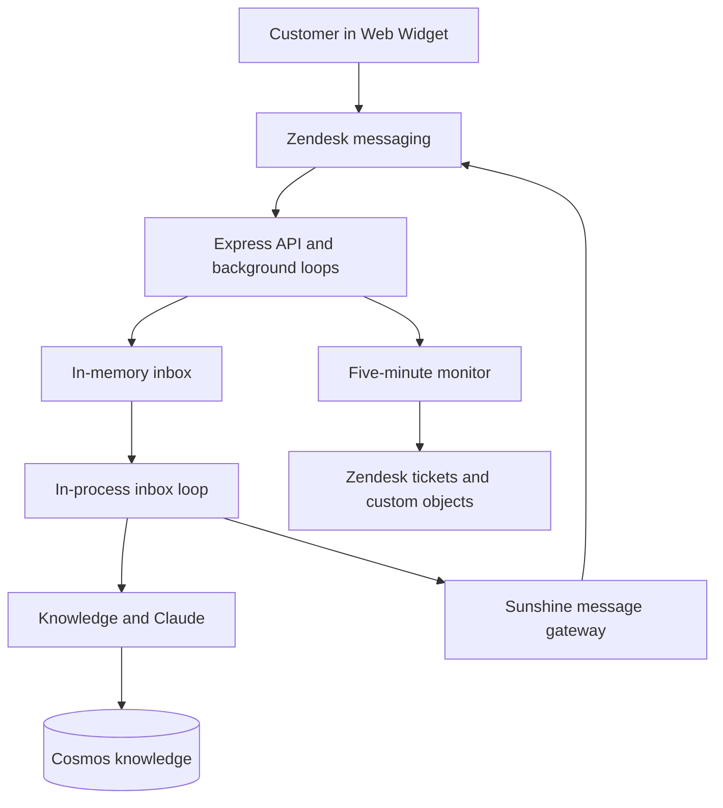
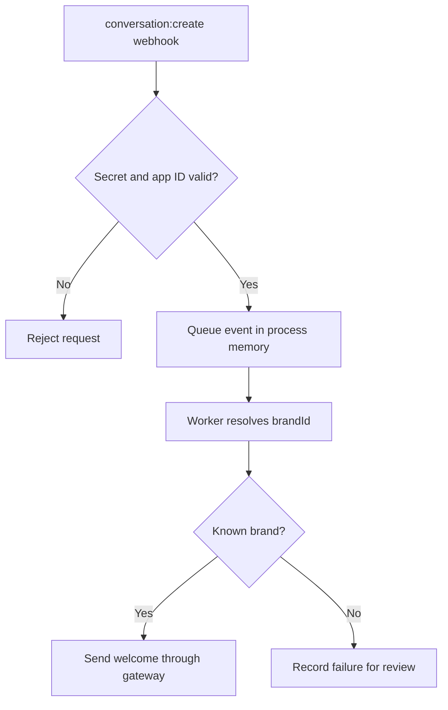
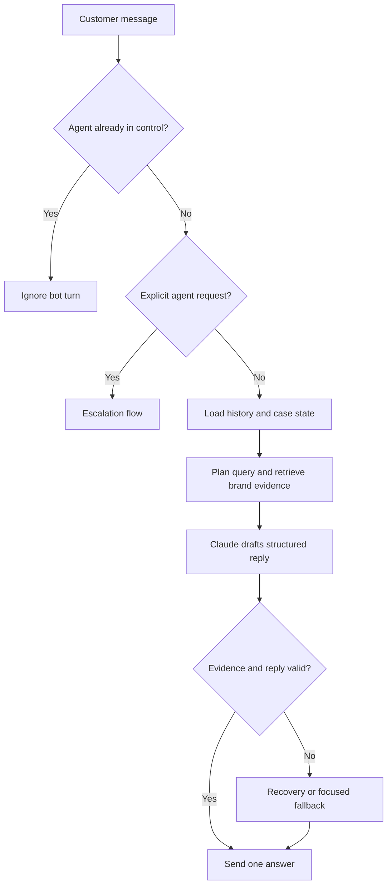
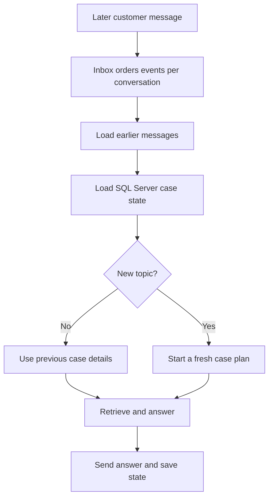
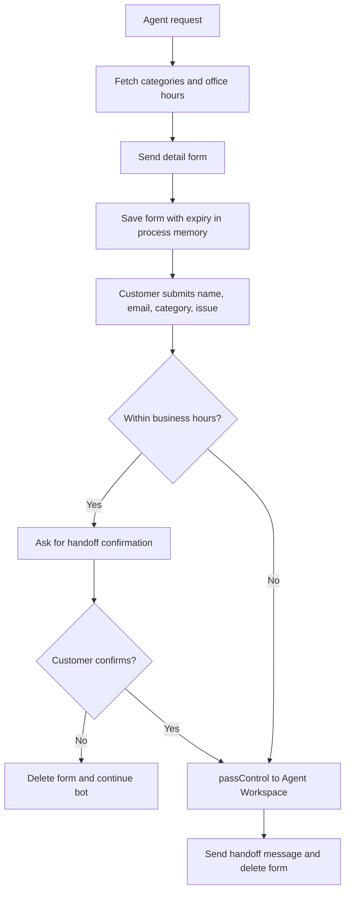
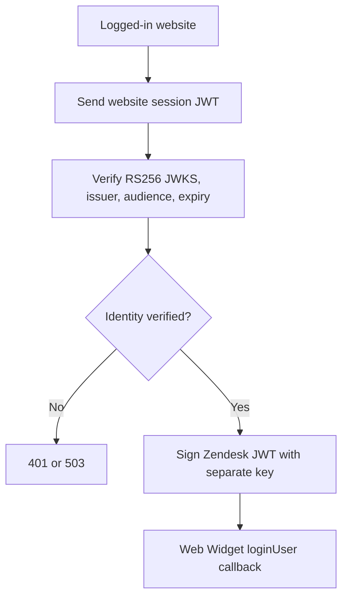
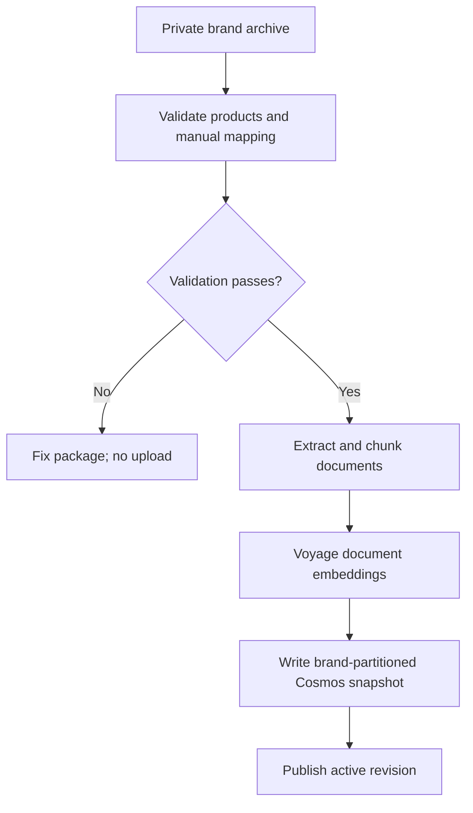
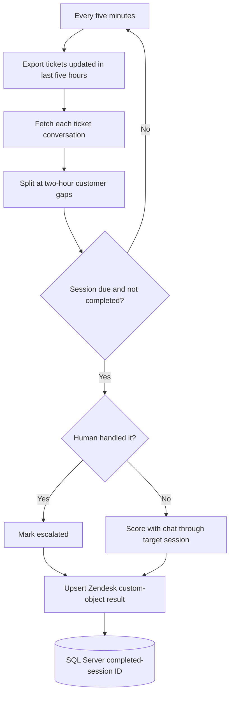
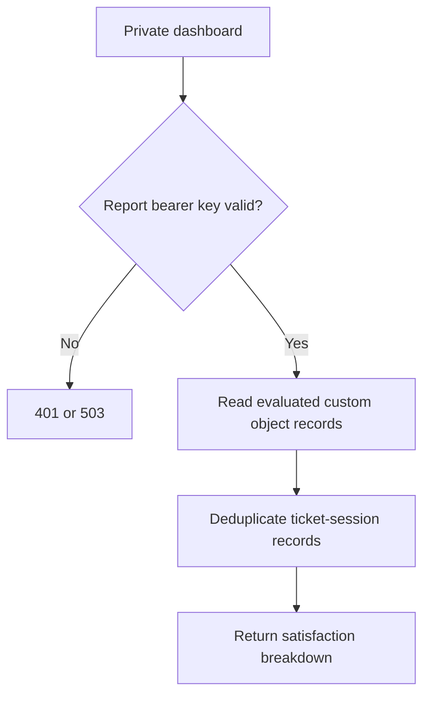
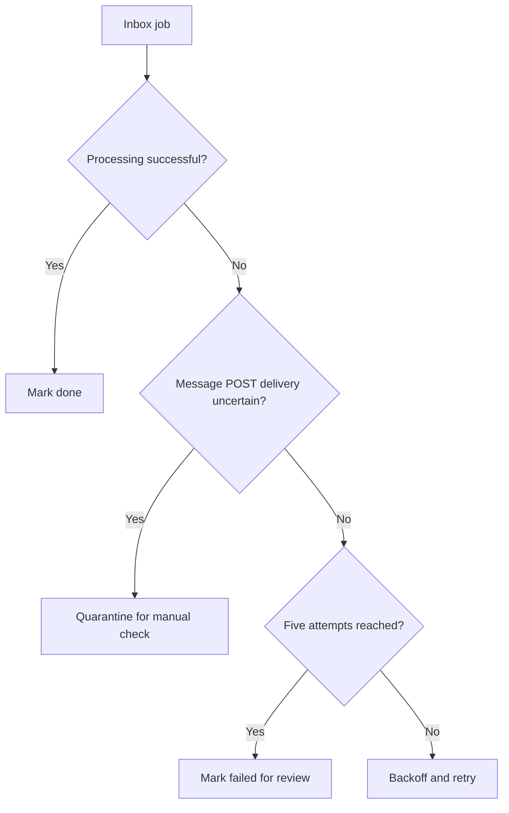

# Project flows by customer and operations case

## 1. Overall runtime

The API acknowledges events after they enter the current process's bounded memory queue. It then wakes the inbox loop in the same `npm start` process. Queued events and recent duplicate IDs are lost on restart; another app instance has a separate queue. The monitoring loop runs independently. A unique event key deduplicates redeliveries while that key remains in memory.

## 2. New conversation and welcome

The brand ID must match `WIDGET_ID_MR_BRAND` or `WIDGET_ID_COMFORT_ZONE`. Unknown brands never search a different brand's knowledge.

## 3. Normal question or FAQ

The question path does not send a progress message. The original retrieval, evidence-label validation and citation audit remain. Greetings and basic information requests bypass the escalation classifier when the heuristic identifies them. The answer model still runs for conversational turns. A generation timeout sends one operational fallback; a failed Sunshine POST is tracked by the inbox.

## 4. Customer follow-up in the same conversation

A follow-up such as “that did not work” can refer to a prior bot answer. Case state survives a web process restart. Customer-visible text is sent once per turn through the gateway.

## 5. Agent handoff and after-hours form

The category maps to a Zendesk group ID only when it is numeric. When no category object is configured, the form offers general support. The handoff `passControl` uses an explicit integration name and is idempotent at Zendesk; it precedes the final confirmation message. Agent-authored messages and agent-owned conversations are not answered by the bot.
Form data expires after 30 minutes and is lost if the app restarts; it is not shared between app instances.

## 6. Authenticated widget user

`sub` becomes `external_id`. The endpoint ignores the request body and only claims a verified email when the website supplies `email_verified: true`. Anonymous users can use the widget without calling this authenticated endpoint if Zendesk permits it.

## 7. Knowledge publication

Use `--validate-only` first. Ingestion is an explicit CLI action, never a web request or background startup task. The two bundled archives remain separate, and the vector dimension must match the embedding model output.

## 8. Five-minute polling and two-hour customer sessions

A customer return before two hours extends the current session. A return after two hours creates another session, even in the same ticket. The evaluator sees the full earlier conversation through the target session, never future outcomes. A unique custom-object external ID and the SQL Server ledger prevent repeated LLM scoring. Silence alone is not considered satisfaction. Only tickets updated in the previous five hours enter a poll.

## 9. Report and failure recovery

A network failure after Sunshine received a message cannot safely be retried as if it were definitely unsent. The `delivery_uncertain` status prevents an automatic duplicate while this process remains alive. See `OPERATIONS.md` for local queue diagnostics and recovery guidance.
